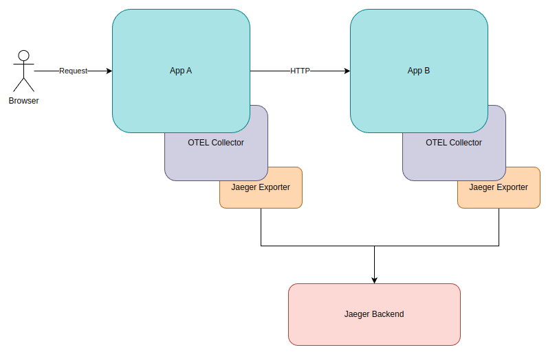
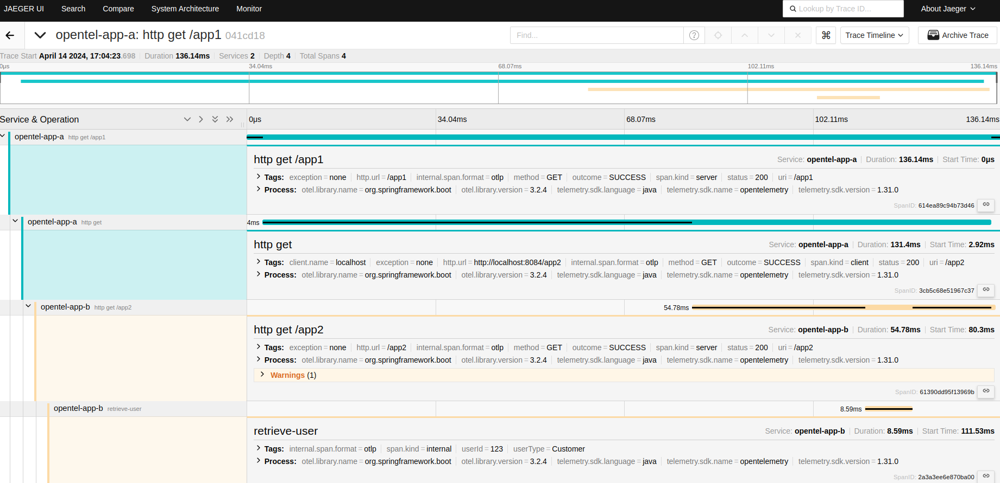

# Tracing with Open Telemetry
This example shows a Spring Boot application A which makes an HTTP request to another Spring Boot application B.

The components are shown below:




## Setup

Deploy the Jaeger backend which will receive the traces from the applications:

```
docker run --rm -d --name jaeger \
  -p 16686:16686 \
  -p 4317:4317 \
  -p 4318:4318 \
  jaegertracing/all-in-one:1.53
```


## Execution

Run both applications located in their respective opentel-app-a and opentel-app-b folders.

Make a request to `http://localhost:8083`

Open the Jaeger UI on the browser: `http://localhost:16686`

In the UI you can see the different spans created during the processing of the HTTP request:



There are four spans:

- **opentel-app-a - http get /app1**: A request arrived to application's A `/app1` endpoint
- **opentel-app-a - http get**: The application A is making an HTTP request. The url is logged as a tag (http.url)
- **opentel-app-b - http get /app2**: A request arrived to application's B `/app2` endpoint
- **opentel-app-b - retrieve user**: This is a custom span created within the `BusinessService` in application B. We added to tags with some business logic (userId = 123, userType = Customer)

