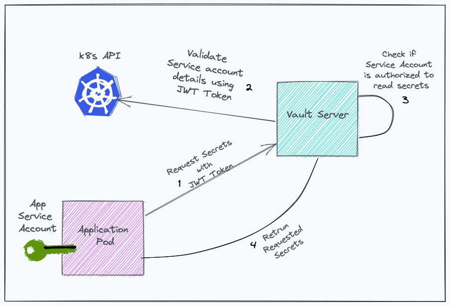

Original guide: https://devopscube.com/vault-in-kubernetes/

## Deployment
```
kubectl apply -f rbac.yaml
kubectl apply -f configmap.yaml
kubectl apply -f services.yaml
kubectl apply -f statefulset.yaml
```

You will see that Vault is not ready yet. This is because it still needs to be unsealed:

```
kubectl get statefulset
NAME    READY   AGE
vault   0/1     7s
```


Let's create tokens and keys for using Vault:

```
kubectl exec vault-0 -- vault operator init -key-shares=1 -key-threshold=1 -format=json > keys.json

VAULT_UNSEAL_KEY=$(cat keys.json | jq -r ".unseal_keys_b64[]")
echo $VAULT_UNSEAL_KEY

VAULT_ROOT_KEY=$(cat keys.json | jq -r ".root_token")
echo $VAULT_ROOT_KEY
```

Now, we unseal Vault:

```
kubectl exec vault-0 -- vault operator unseal $VAULT_UNSEAL_KEY
```

## Setup
Create a service account which will use pods to get secrets from Vault:

```
kubectl create serviceaccount vault-auth
```

Connect to the Vault pod to execute the next actions using the vault cli:

```
kubectl exec -it vault-0 -- /bin/sh
```

### Enable the secret engine

```
vault secrets enable -version=2 -path="demo-app" kv
```


### Create a secret
Create a secret with key 'mykey' and value 'myvalue' inside the path demo-app/user01:

```
vault kv put demo-app/user01 mykey=myvalue
vault kv get demo-app/user01 
```

### Create a policy
By default, the path containing the secrets has a Deny policy. We need a policy to be able to read secrets in the created path:

```
vault policy write demo-policy - <<EOH
path "demo-app/*" {
  capabilities = ["read"]
}
EOH
```

### Enable kubernetes authentication
We need to enable the kubernetes authentication method to be able to read secrets using the service account:

```
vault auth enable kubernetes
```

The following command configures the service account jwt token to enable Vault to access the kubernetes API server. Vault needs this to check if a specific service account is authorized to read secrets.

```
vault write auth/kubernetes/config token_reviewer_jwt="$(cat /var/run/secrets/kubernetes.io/serviceaccount/token)" kubernetes_host="https://$KUBERNETES_PORT_443_TCP_ADDR:443" kubernetes_ca_cert=@/var/run/secrets/kubernetes.io/serviceaccount/ca.crt
```

Now we create a Vault role 'webapp' and bind it to the service account 'vault-auth' we created before, attaching the policy to enable reading secrets:

```
vault write auth/kubernetes/role/webapp \
        bound_service_account_names=vault-auth \
        bound_service_account_namespaces=default \
        policies=demo-policy \
        ttl=72h
```


## UI Access
To login into the UI, we will need a token. Get the token from the environment variable:

```
kubectl exec vault-0 -- vault login $VAULT_ROOT_KEY
```

To reach the Vault UI we need to get the minikube cluster IP:

```
minikube ip
```

And then open the browser and navigate to <cluster_ip>:32000


## Execution

### Vault workflow



Source: https://devopscube.com/wp-content/uploads/2021/07/vault.png


### Read the secret
Deploy a pod which has the service account attached:

```
kubectl apply -f pod.yaml
```

Connect to the pod:

```
kubectl exec -it test sh
```

Let's install 'curl' to be able to request the secret:

```
apk update && apk add curl curl-dev bash
```

Now, we make the first request (#1 in the diagram) to request the Vault token using the service account jwt token:

```
curl --request POST \
    --data '{"jwt": "'$jwt_token'", "role": "webapp"}' \
    http://192.168.99.100:32000/v1/auth/kubernetes/login
```

This request returns the Vault token as 'client_token':

```
{"request_id":"3774f2ba-09be-2287-3b29-bf2e9a91db1c","lease_id":"","renewable":false,"lease_duration":0,"data":null,"wrap_info":null,"warnings":null,"auth":{"client_token":"s.b5rG1xhXGUAtDPjJDrL6tO8b","accessor":"YNjYjlTbbU2b53SpJJ2ZaZYN","policies":["default","demo-policy"],"token_policies":["default","demo-policy"],"metadata":{"role":"webapp","service_account_name":"vault-auth","service_account_namespace":"default","service_account_secret_name":"vault-auth-token-l229j","service_account_uid":"0718cef5-f5cd-11ee-986b-080027284afe"},"lease_duration":259200,"renewable":true,"entity_id":"3124d71a-565f-dd1a-7226-be536160ea6d","token_type":"service","orphan":true}}
```

Finally, we use the Vault token to request the secret stored in Vault:

```
curl -H "X-Vault-Token: s.b5rG1xhXGUAtDPjJDrL6tO8b" \
     -H "X-Vault-Namespace: vault" \
     -X GET http://192.168.99.100:32000/v1/demo-app/data/user01?version=1
```

The response contains the key and value of the requested secret under 'data':

```
{"request_id":"b26c1402-a307-5cf3-3936-e673798911cb","lease_id":"","renewable":false,"lease_duration":0,"data":{"data":{"mykey":"myvalue"},"metadata":{"created_time":"2024-04-08T17:23:12.132704186Z","deletion_time":"","destroyed":false,"version":1}},"wrap_info":null,"warnings":null,"auth":null}
```